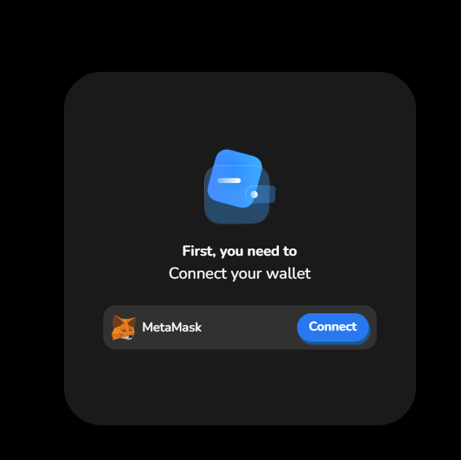
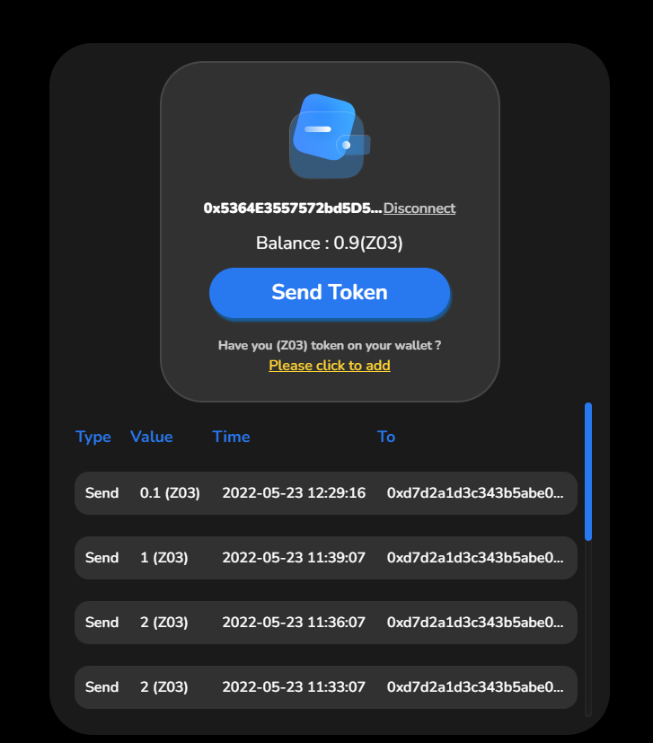
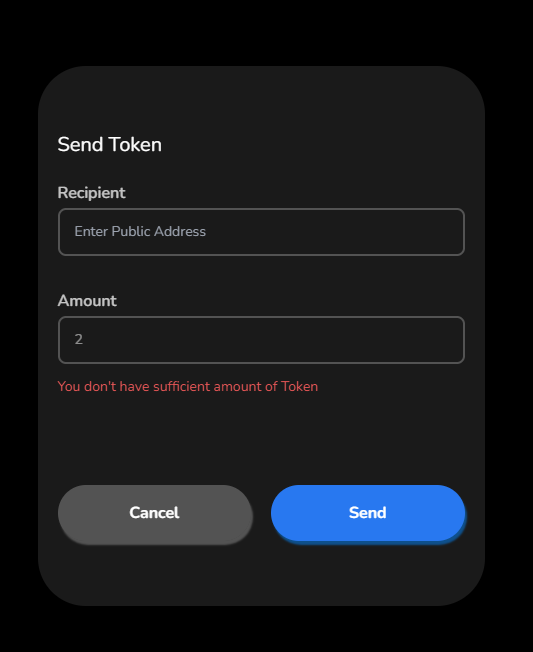
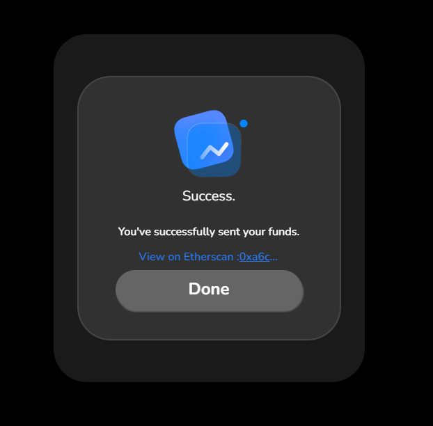

# Blank Wallet

React ( [Next.js](https://nextjs.org/) ) app with typescript template

## Description

App to send Custom ERC720 Token ( (Z03) token 0x8F8Ceeb26b915c1Fb338581B86A9C61f3561dAA3) .

## Demo

-   [https://blockwallet.vercel.app/](https://blockwallet.vercel.app/)

## Package

-   [Next.js](https://nextjs.org/)
-   [@ethersproject](https://github.com/ethers-io/ethers.js)
-   [@web3-react](https://github.com/NoahZinsmeister/web3-react)

## Reference layout

